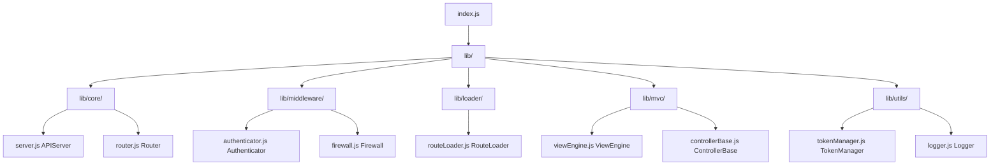
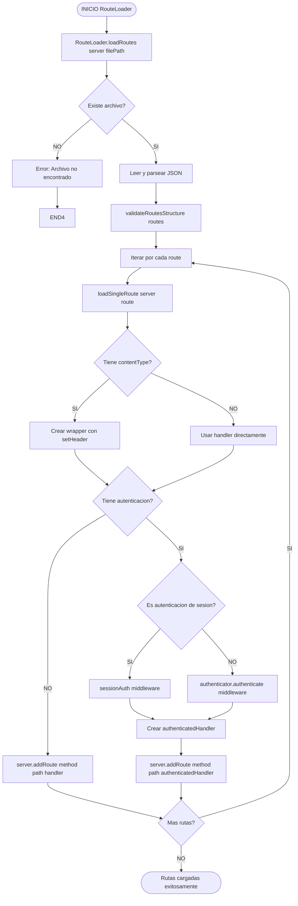
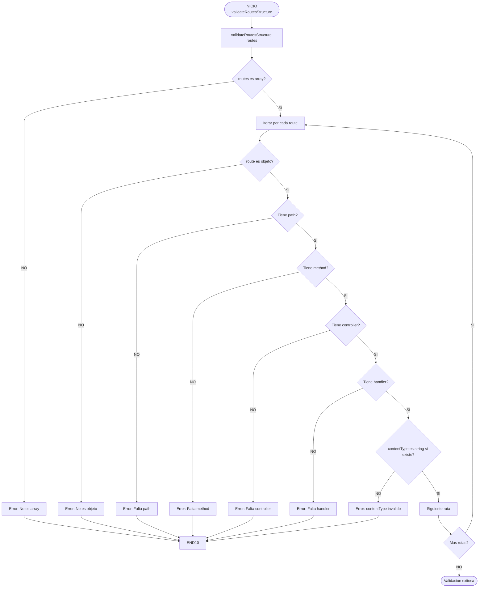
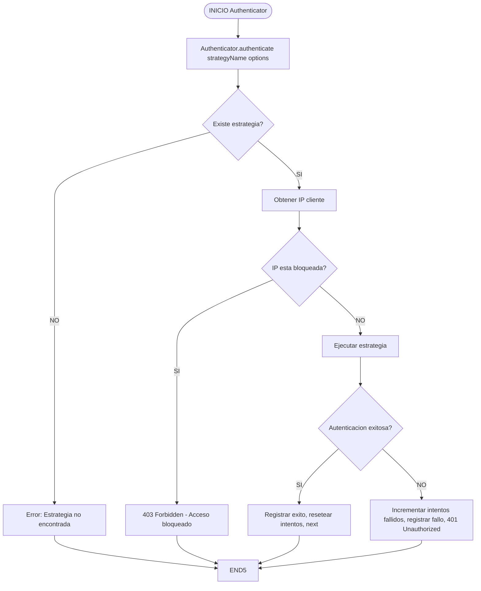
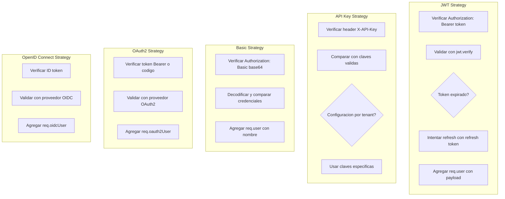
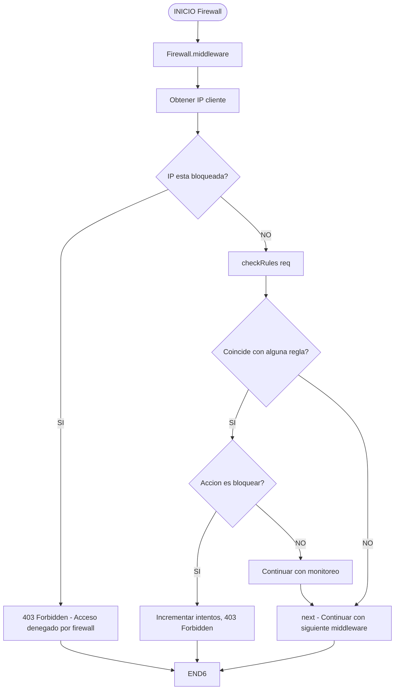
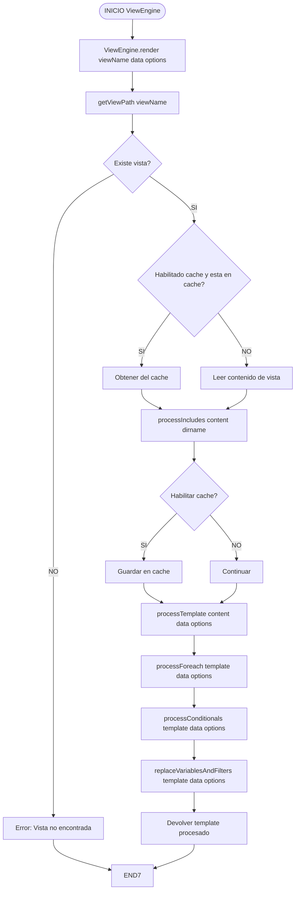
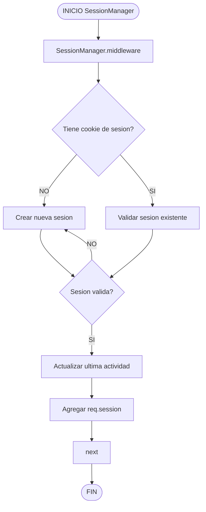
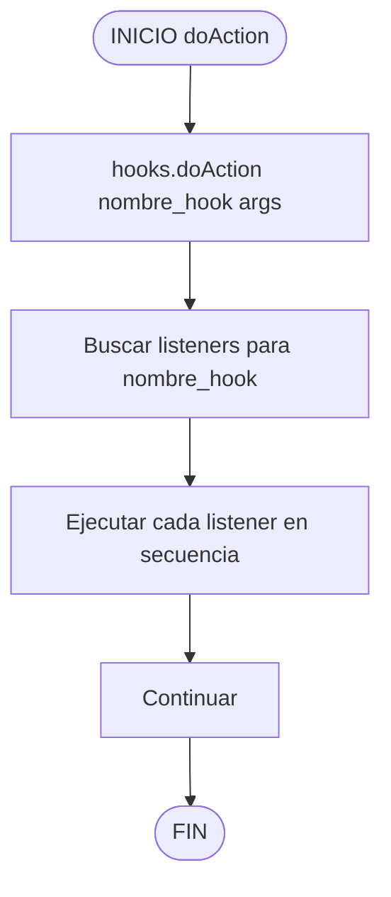
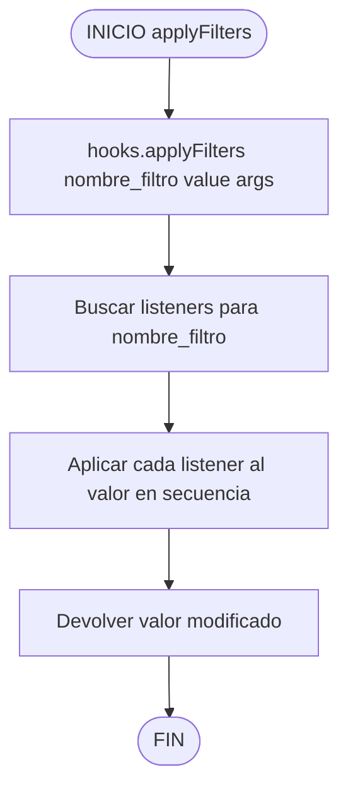

# JERK Framework v2.0 - Documentación Técnica y Diagramas de Arquitectura

## Introducción

JERK Framework v2.0 es un framework de servidor HTTP ligero y modular diseñado para aplicaciones web modernas. Este documento proporciona una visión completa de la arquitectura del framework, incluyendo todos los flujos de datos, procesos internos y estructuras de archivos. La documentación está organizada en secciones que cubren desde el flujo principal de solicitudes HTTP hasta los detalles más específicos de cada componente del sistema.

El framework sigue una arquitectura modular que separa claramente las responsabilidades entre diferentes capas: servidor HTTP, enrutamiento, middlewares, carga de rutas, motor de plantillas, gestión de sesiones y autenticación. Esta separación permite que cada componente funcione de manera independiente mientras trabaja en conjunto para procesar solicitudes HTTP de manera eficiente y segura.

La documentación técnica que se presenta a continuación incluye diagramas de flujo Mermaid que ilustran visualmente los procesos internos del framework. Estos diagramas están diseñados para facilitar la comprensión de la lógica de negocio y los flujos de datos, lo cual es especialmente útil para desarrolladores que necesitan mantener o extender el framework.

---

## 1. Estructura de Archivos del Proyecto

La organización del proyecto JERK Framework v2.0 sigue una estructura de directorios clara y escalable que separa los componentes por funcionalidad. Esta estructura permite un mantenimiento más sencillo del código y facilita la comprensión de las relaciones entre los diferentes módulos del framework.



### Descripción de los Directorios Principales

El directorio `lib/core/` contiene los componentes esenciales del framework que definen la funcionalidad base del servidor HTTP. El archivo `server.js` implementa la clase `APIServer` que es el punto de entrada principal para el manejo de solicitudes, mientras que `router.js` contiene la lógica de enrutamiento que determina qué handler debe ejecutarse para cada solicitud entrante.

El directorio `lib/middleware/` alberga todos los middlewares disponibles en el framework. El archivo `authenticator.js` implementa múltiples estrategias de autenticación, incluyendo JWT, API Key, Basic, OAuth2 y OpenID Connect. El archivo `firewall.js` proporciona funcionalidad de seguridad para bloquear direcciones IP maliciosas y aplicar reglas de seguridad personalizadas.

El directorio `lib/loader/` contiene el `routeLoader.js` que es responsable de cargar las definiciones de rutas desde archivos JSON y registrarlas en el servidor. Esta separación permite que las rutas se definan en archivos de configuración externos, facilitando la organización y mantenimiento de las rutas de la aplicación.

El directorio `lib/mvc/` implements el patrón Modelo-Vista-Controlador con el motor de plantillas `viewEngine.js` y la clase base `controllerBase.js` que proporciona funcionalidades comunes para todos los controladores de la aplicación.

El directorio `lib/utils/` contiene utilidades auxiliares como el `tokenManager.js` para la gestión de tokens JWT y el `logger.js` para el registro de eventos y errores del sistema.

---

## 2. Flujo Principal de Solicitud HTTP

El flujo principal de una solicitud HTTP en JERK Framework v2.0 sigue una secuencia bien definida de pasos que comienzan con la recepción de la solicitud y terminan con el envío de la respuesta al cliente. Este flujo está diseñado para manejar tanto solicitudes simples como solicitudes complejas que requieren múltiples middlewares y procesamiento asíncrono.

El proceso inicia cuando el servidor recibe una solicitud HTTP y verifica que el método utilizado sea válido. Si el método no está soportado, el servidor responde con un error 405 Method Not Allowed. Una vez validado el método, se procede a parsear la URL para extraer el pathname y los parámetros de consulta, los cuales se almacenan en las propiedades `req.query` y `req.params` del objeto de solicitud.

A continuación, el servidor captura el cuerpo de la solicitud respetando un límite máximo de tamaño configurado. Si el tamaño del cuerpo excede este límite, el servidor responde con un error 413 Request Too Large. En caso contrario, se procede a parsear el cuerpo de la solicitud si el tipo de contenido es JSON.

```mermaid
flowchart TD
    START([INICIO])
    START --> A[APIServer.start]
    A --> B[HTTP Request recibido]
    B --> C[Verificar metodo HTTP]
    C --> D{Es metodo valido?}
    D -->|NO| E[405 Method Not Allowed]
    E --> END([FIN])
    D -->|SI| F[Parse URL: pathname, query]
    F --> G[req.query = query]
    G --> H[req.params = {}]
    H --> I[req.body = '', bodySize = 0]
    I --> J[Capturar body con limite maxBodySize]
    J --> K{bodySize > maxBodySize?}
    K -->|SI| L[413 Request Too Large]
    L --> END
    K -->|NO| M[Fin de recepcion de datos]
    M --> N{Es JSON content-type?}
    N -->|SI| O[Parse body como JSON]
    N -->|NO| P[Continuar con raw body]
    O --> Q{Es solicitud OPTIONS?}
    P --> Q
    Q -->|SI| R[Ejecutar middlewares CORS]
    R --> S{Hay ruta especifica para OPTIONS?}
    S -->|SI| T[Agregar parametros req.params]
    T --> U[Ejecutar handler de ruta]
    U --> END
    S -->|NO| V[204 No Content]
    V --> END
    Q -->|NO| W[findRoute method pathname]
    W --> X{Ruta encontrada?}
    X -->|NO| Y[404 Not Found]
    Y --> END
    X -->|SI| Z[Agregar parametros req.params]
    Z --> AA[Ejecutar middlewares en secuencia]
    AA --> BB{Middleware respondio?}
    BB -->|SI| END
    BB -->|NO| CC[Ejecutar handler de ruta]
    CC --> DD{Handler es asincrono?}
    DD -->|SI| EE[await handler req res]
    DD -->|NO| FF[handler req res]
    EE --> END
    FF --> END
```

Para solicitudes OPTIONS, el framework ejecuta los middlewares CORS configurados para determinar si hay una ruta específica definida para manejar este tipo de solicitudes. Si existe una ruta específica, se agregan los parámetros correspondientes y se ejecuta el handler asociado. Si no existe una ruta específica, el servidor responde con un código 204 No Content.

Cuando la solicitud no es OPTIONS, el framework busca una ruta coincidente utilizando la función `findRoute()` que toma como parámetros el método HTTP y el pathname de la solicitud. Si no se encuentra ninguna ruta, el servidor responde con un error 404 Not Found. Si se encuentra una ruta, se agregan los parámetros extraídos al objeto `req.params` y se procede a ejecutar los middlewares registrados en secuencia.

Cada middleware tiene la opción de responder directamente a la solicitud o pasar el control al siguiente middleware. Si algún middleware responde, el flujo termina y la respuesta se envía al cliente. Si ningún middleware responde, se ejecuta el handler de ruta asociado. El framework soporta tanto handlers síncronos como asíncronos, utilizando `await` para los handlers asíncronos.

---

## 3. Algoritmo de Enrutamiento: findRoute()

El algoritmo de enrutamiento de JERK Framework v2.0 implementa un sistema de búsqueda de dos niveles que primero intenta encontrar una coincidencia exacta y, si no la encuentra, procede a buscar rutas parametrizadas que coincidan con el patrón de la URL solicitada.

El algoritmo comienza buscando una coincidencia exacta entre el pathname de la solicitud y las rutas registradas en el servidor. Esta búsqueda es extremadamente rápida ya que utiliza una tabla hash para almacenar las rutas exactas. Si se encuentra una coincidencia exacta, se devuelve inmediatamente el objeto de ruta con un objeto de parámetros vacío.

```mermaid
flowchart TD
    START1([INICIO findRoute])
    START1 --> A1[findRoute method pathname]
    A1 --> B1[Busqueda de ruta exacta]
    B1 --> C1{Encuentra ruta exacta?}
    C1 -->|SI| D1[Devolver route, params: {}]
    D1 --> END1([FIN])
    C1 -->|NO| E1[Busqueda de rutas parametrizadas]
    E1 --> F1[Iterar por cada ruta]
    F1 --> G1{Mismo metodo HTTP?}
    G1 -->|NO| H1[Siguiente ruta]
    G1 -->|SI| I1[Convertir ruta a regex: pathToRegex route.path]
    I1 --> J1{pathname.match routeRegex?}
    J1 -->|SI| K1[Extraer parametros: extractParams route.path pathname]
    K1 --> L1[Devolver route, params]
    L1 --> END1
    J1 -->|NO| H1
    H1 --> M1{Mas rutas?}
    M1 -->|SI| F1
    M1 -->|NO| N1[Devolver null]
    N1 --> END1
```

Si no se encuentra una coincidencia exacta, el algoritmo itera a través de todas las rutas parametrizadas registradas para el método HTTP solicitado. Para cada ruta, primero verifica que el método HTTP coincida. Si no coincide, continúa con la siguiente ruta. Si coincide, convierte la ruta a una expresión regular utilizando la función `pathToRegex()`.

La expresión regular generada se utiliza para verificar si el pathname de la solicitud coincide con el patrón de la ruta. Si coincide, se extraen los parámetros dinámicos utilizando la función `extractParams()` y se devuelve el objeto de ruta junto con los parámetros extraídos. Si no coincide, se continúa con la siguiente ruta. Este proceso continúa hasta encontrar una coincidencia o agotar todas las rutas disponibles.

---

## 4. Conversión de Rutas a Expresiones Regulares: pathToRegex()

La función `pathToRegex()` es responsable de convertir rutas con parámetros dinámicos en expresiones regulares que pueden utilizarse para hacer coincidir URLs entrantes. Este proceso es fundamental para el sistema de enrutamiento parametrizado del framework.

```mermaid
flowchart TD
    START2([INICIO pathToRegex])
    START2 --> A2[pathToRegex path]
    A2 --> B2[Escapar caracteres especiales]
    B2 --> C2[Reemplazar :param con [^/]+?]
    C2 --> D2[Crear RegExp: new RegExp ^${regexPath}$]
    D2 --> END2([FIN])
```

El proceso comienza escapando todos los caracteres especiales de la ruta para evitar que sean interpretados como metacaracteres de expresiones regulares. A continuación, se reemplazan los marcadores de parámetros (como `:id`, `:userId`, `:productId`) con el patrón de expresión regular `([^/]+?)`, que captura cualquier secuencia de caracteres que no contenga barras diagonales.

Finalmente, se construye un objeto RegExp que envuelve el patrón generado con anclas de inicio (`^`) y fin (`$`) para asegurar que la URL completa coincida con el patrón, no solo una parte de ella. Esta expresión regular se utilizará posteriormente para verificar si el pathname de la solicitud coincide con el patrón de la ruta.

---

## 5. Extracción de Parámetros: extractParams()

La función `extractParams()` extrae los valores de los parámetros dinámicos de una URL que coincide con una ruta parametrizada. Esta función complementa a `pathToRegex()` proporcionando una interfaz para acceder a los valores capturados por la expresión regular.

```mermaid
flowchart TD
    START3([INICIO extractParams])
    START3 --> A3[extractParams routePath actualPath]
    A3 --> B3[Encontrar parametros con /:([a-zA-Z0-9_]+)/g]
    B3 --> C3[Crear array paramNames]
    C3 --> D3[Generar routeRegex con pathToRegex]
    D3 --> E3[Obtener values con actualPath.match routeRegex]
    E3 --> F3[Asignar valores: params paramNames i = values i+1]
    F3 --> G3[Devolver params]
    G3 --> END3([FIN])
```

El proceso comienza extrayendo los nombres de los parámetros de la ruta utilizando una expresión regular que busca todos los marcadores de parámetros (`/:([a-zA-Z0-9_]+)/g`). Estos nombres se almacenan en un array que se utilizará posteriormente para construir el objeto de parámetros.

A continuación, se genera una expresión regular para la ruta utilizando la función `pathToRegex()`. Esta expresión regular se utiliza para hacer coincidir el pathname real de la solicitud. El resultado de esta coincidencia es un array donde el primer elemento es la URL completa coincidente y los elementos siguientes son los valores capturados para cada parámetro.

Finalmente, se construye el objeto de parámetros asignando cada valor capturado al nombre del parámetro correspondiente. Los nombres de los parámetros se obtienen del array creado anteriormente y los valores se obtienen del resultado de la coincidencia de la expresión regular. El resultado es un objeto que mapea cada nombre de parámetro a su valor correspondiente en la URL.

---

## 6. Flujo de Carga de Rutas

El flujo de carga de rutas es el proceso mediante el cual JERK Framework v2.0 carga y registra las rutas definidas en archivos JSON externos. Este proceso incluye validación de la estructura de las rutas, procesamiento de cada ruta individual y aplicación de middlewares de autenticación cuando corresponde.

El proceso comienza verificando que el archivo de rutas exista en la ubicación especificada. Si el archivo no existe, se genera un error y el proceso termina. Si el archivo existe, se lee su contenido y se parsea como JSON. A continuación, se valida la estructura del array de rutas para asegurar que cada elemento contenga todas las propiedades requeridas.



Para cada ruta en el array, se verifica si tiene un tipo de contenido personalizado definido. Si lo tiene, se crea un wrapper que establece el header de tipo de contenido antes de ejecutar el handler. Esto permite que diferentes rutas devuelvan diferentes tipos de contenido sin modificar el handler principal.

A continuación, se verifica si la ruta requiere autenticación. Si no la requiere, el handler se registra directamente en el servidor. Si la requiere, se determina qué tipo de autenticación debe aplicarse (basada en sesión o basada en token) y se crea un handler autenticado que envolverá el handler original. Este handler autenticado ejecutará el middleware de autenticación correspondiente antes de permitir el acceso al handler de la ruta.

---

## 7. Validación de Estructura de Rutas

La validación de la estructura de rutas es un paso crítico en el proceso de carga de rutas que asegura que todas las rutas definidas cumplan con los requisitos mínimos del framework. Esta validación previene errores en tiempo de ejecución al detectar problemas de configuración antes de que el servidor comience a procesar solicitudes.



La validación comienza verificando que el parámetro `routes` sea un array. Si no lo es, se genera un error indicando que la estructura de rutas debe ser un array. A continuación, se itera por cada elemento del array y se verifica que sea un objeto. Si algún elemento no es un objeto, se genera un error correspondiente.

Para cada objeto de ruta, se verifican las propiedades requeridas en el siguiente orden: `path`, `method`, `controller` y `handler`. Cada una de estas propiedades es obligatoria y si falta cualquiera de ellas, se genera un error específico indicando cuál es la propiedad faltante. La propiedad `contentType` es opcional pero, si existe, debe ser una cadena de texto válida.

---

## 8. Sistema de Autenticación

El sistema de autenticación de JERK Framework v2.0 implementa múltiples estrategias que permiten a los desarrolladores elegir el método de autenticación más apropiado para su aplicación. Cada estrategia tiene sus propias características y casos de uso específicos.

El proceso de autenticación comienza verificando que la estrategia solicitada exista y esté configurada correctamente. Si la estrategia no existe, se genera un error indicando que no se encontró la estrategia solicitada. A continuación, se obtiene la dirección IP del cliente para verificar si está bloqueada por el firewall.



Si la IP del cliente está bloqueada, el servidor responde con un error 403 Forbidden indicando que el acceso fue bloqueado por el firewall. Si la IP no está bloqueada, se procede a ejecutar la estrategia de autenticación configurada. El resultado de esta ejecución determina si la autenticación fue exitosa o fallida.

En caso de éxito, se registra el evento de autenticación exitosa, se resetean los intentos fallidos previos del cliente y se llama a la función `next()` para continuar con el procesamiento de la solicitud. En caso de fallo, se incrementa el contador de intentos fallidos, se registra el evento de fallo y se responde con un error 401 Unauthorized.

---

## 9. Estrategias de Autenticación Disponibles

JERK Framework v2.0 soporta cinco estrategias de autenticación principales, cada una diseñada para diferentes escenarios de seguridad y requisitos de integración.



### JWT Strategy (JSON Web Tokens)

La estrategia JWT es ideal para aplicaciones que requieren autenticación sin estado y compatibilidad con aplicaciones móviles y APIs. La estrategia verifica el header Authorization buscando un token Bearer, valida el token utilizando `jwt.verify()`, y si el token está expirado, intenta renovarlo utilizando un refresh token. Una vez validado, el payload decodificado se agrega al objeto `req.user`.

### API Key Strategy

La estrategia de API Key es adecuada para autenticación de servicios y sistemas externos que necesitan acceso programático a la API. La estrategia verifica el header X-API-Key y lo compara con las claves válidas almacenadas. Si la configuración incluye multi-tenancy, se utilizan claves específicas para cada tenant.

### Basic Strategy

La estrategia Basic es simple y rápida de implementar, adecuada para aplicaciones internas o APIs que operan sobre HTTPS. La estrategia decodifica las credenciales codificadas en base64 del header Authorization y las compara con las credenciales almacenadas. Si las credenciales son válidas, el nombre de usuario se agrega a `req.user`.

### OAuth2 Strategy

La estrategia OAuth2 es adecuada para aplicaciones que necesitan integrarse con proveedores de identidad externos como Google, Facebook o Microsoft. La estrategia verifica tokens Bearer o códigos de autorización, los valida con el proveedor OAuth2 correspondiente, y agrega el usuario autenticado a `req.oauth2User`.

### OpenID Connect Strategy

La estrategia OpenID Connect extiende OAuth2 proporcionando autenticación federada con verificación de identidad. Es ideal para aplicaciones empresariales que necesitan autenticación SSO (Single Sign-On) con proveedores de identidad compatibles con OIDC.

---

## 10. Sistema de Firewall

El sistema de firewall de JERK Framework v2.0 proporciona una capa adicional de seguridad que protege la aplicación contra direcciones IP maliciosas y ataques automatizados. El firewall opera como un middleware que se ejecuta antes de cualquier otro procesamiento de solicitud.



El proceso del firewall comienza obteniendo la dirección IP del cliente de la solicitud. A continuación, verifica si esta IP está en la lista de IPs bloqueadas. Si está bloqueada, responde inmediatamente con un error 403 Forbidden indicando que el acceso fue denegado por el firewall.

Si la IP no está bloqueada, el firewall verifica si la solicitud coincide con alguna regla de seguridad personalizada. Estas reglas pueden definir patrones de comportamiento malicioso, como solicitudes a rutas sensibles o patrones de tráfico anómalos. Si se encuentra una coincidencia, se verifica si la acción configurada es bloquear o simplemente monitorear.

Si la acción es bloquear, se incrementa el contador de intentos fallidos para esa IP y se responde con un error 403 Forbidden. Si la acción es monitorear, se permite que la solicitud continúe pero se registra el evento para análisis posterior. Si ninguna regla coincide, la solicitud continúa normalmente con el siguiente middleware.

---

## 11. Motor de Plantillas (ViewEngine)

El motor de plantillas de JERK Framework v2.0 proporciona funcionalidad para renderizar vistas HTML dinámicas utilizando un sistema de plantillas flexible que soporta includes, bucles condicionales y filtros de variables.



El proceso de renderizado comienza determinando la ruta completa del archivo de vista solicitado. Si el archivo de vista no existe, se genera un error indicando que la vista no fue encontrada. Si el archivo existe, se verifica si el sistema de caché está habilitado y si la vista ya está almacenada en caché.

Si la vista está en caché, se obtiene directamente del caché para evitar la lectura del archivo y el procesamiento repetido. Si no está en caché, se lee el contenido del archivo de vista. Antes de procesar la plantilla, se procesan los includes que pueden insertar el contenido de otras plantillas dentro de la plantilla principal.

Si el caché está habilitado, el contenido procesado se almacena en caché para futuras solicitudes de la misma vista. A continuación, se procede a procesar la plantilla completa, lo que incluye el procesamiento de bucles foreach, la evaluación de condicionales, y la sustitución de variables y filtros.

---

## 12. Sistema de Sesiones

El sistema de sesiones de JERK Framework v2.0 proporciona gestión de estado del lado del servidor mediante cookies de sesión. Este sistema permite mantener información del usuario entre múltiples solicitudes HTTP.



El middleware de sesiones comienza verificando si la solicitud incluye una cookie de sesión. Si no incluye cookie de sesión, se crea una nueva sesión y se genera un identificador único que se almacena en una cookie en el cliente. Si incluye cookie de sesión, se recupera la sesión existente del almacenamiento del servidor.

A continuación, se valida la sesión existente verificando que no haya expirado y que los datos de la sesión sean válidos. Si la sesión no es válida, se destruye y se crea una nueva sesión. Si la sesión es válida, se actualiza el timestamp de última actividad para mantener la sesión activa.

Finalmente, se agrega el objeto de sesión al objeto de solicitud (`req.session`) y se llama a la función `next()` para continuar con el procesamiento de la solicitud. El objeto de sesión está disponible para todos los middlewares y handlers posteriores que necesiten acceder a la información del usuario.

---

## 13. Sistema de Hooks

El sistema de hooks de JERK Framework v2.0 implementa un patrón de extensibilidad que permite a los desarrolladores modificar o extender el comportamiento del framework en puntos específicos de la ejecución. El sistema soporta dos tipos de hooks: acciones y filtros.

### Acciones (doAction)

Las acciones son hooks que ejecutan código en puntos específicos del ciclo de vida de la aplicación. No retornan ningún valor y se utilizan para realizar tareas secundarias como registro de日志 o limpieza de recursos.



### Filtros (applyFilters)

Los filtros son hooks que reciben un valor, lo modifican y retornan el valor modificado. Se utilizan para transformar datos en puntos específicos del procesamiento, como modificar el contenido de una respuesta antes de enviarla al cliente.



El sistema de hooks mantiene un registro de todos los listeners registrados para cada hook. Cuando se ejecuta un hook, el sistema busca todos los listeners asociados, los ejecuta en el orden en que fueron registrados, y pasa los argumentos correspondientes. Para los filtros, cada listener puede modificar el valor que se pasa al siguiente listener en la cadena.

---

## 14. Resumen de Arquitectura

La arquitectura de JERK Framework v2.0 está diseñada para proporcionar un equilibrio entre simplicidad y funcionalidad. El framework sigue principios de diseño que facilitan tanto el desarrollo rápido de aplicaciones como la escalabilidad a medida que los requisitos de la aplicación crecen.

El flujo principal de solicitudes HTTP sigue una secuencia clara que comienza con la recepción de la solicitud y termina con el envío de la respuesta. En el camino, la solicitud atraviesa múltiples capas de procesamiento que incluyen validación de parámetros, verificación de autenticación, búsqueda de rutas, ejecución de middlewares y renderizado de vistas.

El sistema de enrutamiento es eficiente y flexible, permitiendo tanto rutas exactas como rutas parametrizadas. La implementación de expresiones regulares permite patrones de URL complejos mientras mantiene un rendimiento óptimo. El sistema de parámetros extraídos proporciona acceso sencillo a los valores dinámicos de la URL.

El sistema de seguridad integrado proporciona múltiples capas de protección, incluyendo firewall de IP, autenticación flexible y validación de entrada. Las múltiples estrategias de autenticación permiten que el framework se adapte a diferentes requisitos de seguridad y escenarios de integración.

El motor de plantillas y el sistema de sesiones proporcionan funcionalidades esenciales para aplicaciones web modernas. El sistema de hooks permite una extensibilidad profunda del framework sin modificar el código base, facilitando la creación de plugins y extensiones reutilizables.

---

## Referencias de Archivos

- **Archivo principal de entrada**: `index.js`
- **Núcleo del servidor**: `lib/core/server.js`, `lib/core/router.js`
- **Middlewares de seguridad**: `lib/middleware/authenticator.js`, `lib/middleware/firewall.js`
- **Cargador de rutas**: `lib/loader/routeLoader.js`
- **Componentes MVC**: `lib/mvc/viewEngine.js`, `lib/mvc/controllerBase.js`
- **Utilidades**: `lib/utils/tokenManager.js`, `lib/utils/logger.js`

---

*Documentación generada para JERK Framework v2.0. Para más información, consulte la guía de inicio rápido en `docs/guia_inicio_rapido_jerkjs.md`.*
